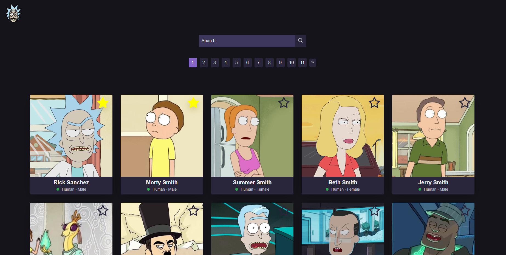
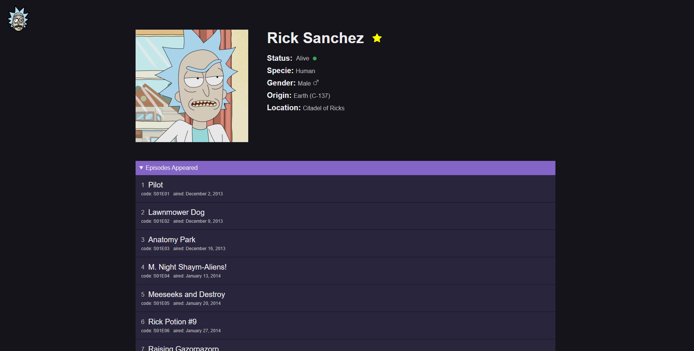
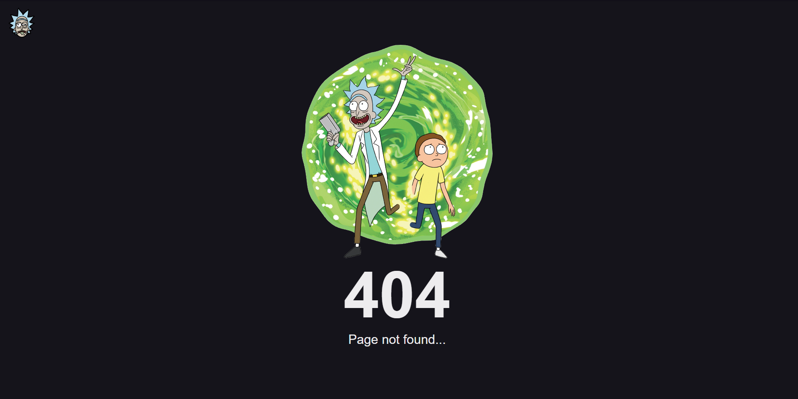

## Project Overview

Project built with [Next.js](https://nextjs.org/) as a practice with the [Rick and Morty API](https://rickandmortyapi.com) aiming to build a Rick and Morty Wiki.

This project was deploayed at [Vercel](https://vercel.com) and can be accesed by clicking [here](https://rick-and-morty-wiki-chi.vercel.app).

The first page consists into a list with pagination of all the characters from the series, including a search feature that searches globally for a character independent of the page he is located. 

There is also a feature of adding a character to favourites, which uses localstorage to keep track of the data in your browser.



When u click into a character you are redirected to a details page, containing the character information and the appeared episodes. In this page is also possible to toggle the favourite status of the character.



In case you go into some invalid URL you will get the coolest 404 page


## Technologies Used


<div >
    <a href="https://nextjs.org/">
    
    </a>
     <a href="https://tanstack.com/query/v3/">
    
    </a>
     <a href="https://www.styled-components.com">
    
    </a>
    <a href="https://www.cypress.io">
    
    </a>
</div>


## Running the project

First, run the development server:

```bash
npm run dev
```
Open [http://localhost:3000](http://localhost:3000) with your browser to see the result.

## Running Tests

The components were tested using [Cypress](https://www.cypress.io). For running the tests in the Cypress GUI use the command:

```bash
npx cypress open
```


